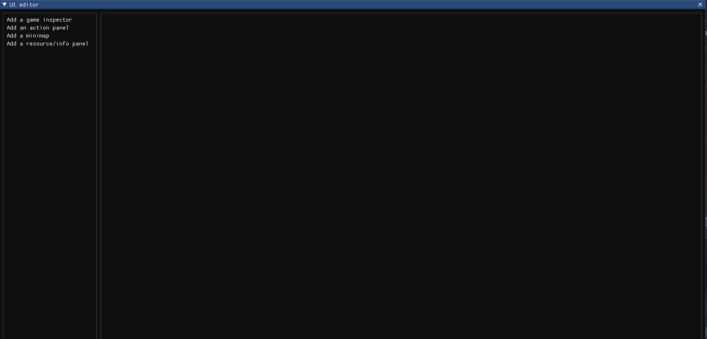

# ___Cookie Engine___

Cookie Engine is a scholar project which aims to create a Game Engine specialized for the creation of RTS Games,
In addition we provide a simple standalone game to illustrate a possible usage and capabilities of our Engine.

___

## __Authors__

The project has been developed as a school assignment of ISART Digital the project is then theirs and the authors property. However, the assets are from our game artist that is external of any of this and she licence these over the CC license:

 This work is licensed under a <a rel="license" href="http://creativecommons.org/licenses/by/4.0/">Creative Commons Attribution 4.0 International License</a>.

The project was done by Game Programmer and a Game Artist:

| Name | Role |
|:---:|:---:|
|Mélie Chopin| Game Programmer
|Anatole Todorov| Game Programmer
|Hugo Chemouny| Game Programmer
|Quentin Bleuse| Game Programmer
|Coline Bleuse| Game Artist

___

## __Table of Contents__

- [Techs](#L38)
- [To Build](#L53)
- [To Run](#L68)
- [Additional Notes](#L75)
- [User Manual](#L80)

___

## __Techs__

- C++ for the Code Base
- DirectX3D 11 For Graphic API
- ImGui For The UI Framework
- glfw For Window Manager
- Assimp to load models
- WIC and the DDSTextureLoader of DirectXTex for texture loading
- FMod for music playing and loading
- CMake to compile
- Sol3 and lua for scripting
- reactphysics3D for the physics engine

___

## __To Build__

The project has been compiled using the support of Visual Studio for CMake mainly with Ninja, and clang-cl on windows,
we guarantee at least that it will compile using this method.

The CMakeSettings.json is available to compile,
you can change the compiler and the generator if you do not want to use clang and Ninja, nor msvc and Ninja.

/!\ Be careful, some option of the Cmake does not work suvh as game-only compiling /!\

Assets for the Project are available in the Following Google Drive: https://drive.google.com/drive/folders/1MkweOgCSBc_fAu7KRT-KTbGxjArFwXry?usp=sharing
... the folder need to be put on the same folder of the executable.

___

## __To Run__

After the compile succeeded the executable can be found in the build/ folder generated by CMake,
the path can be changed in the CMakeSettings.json .

___

## __Additional Notes__

We do not have rights over the Fmod so we removed it for this release, however the code that used it is still available in the files that uses sound.
___

## __User Manual__

This part is the user manual of our engine, it will present to you the feature available and how to use our Engine to make your own game.

Once you run the editor, it should look like this:

it might look like that when you open it for the first time:

it is because the imgui.ini was not copied properly during compilation or that it is not near the executable but, do not worry, you can just expand them and put them such as shown below.

this is the example for the viewport but all widget can be expanded and placed to your desire.
if you do not have the widget opened you can find them as shown below, in the Edit or Window options above.

we will now see the different widget at your disposal:

___

## __ToolBar__

The buttons on the left allows you to change the things to change with the gizmos: starting from the right, translation, rotation, scale.

The buttons in the middle allows you to play the game, to pause it and to run it frame by frame.

___

## __Viewport__

Allows you to see the scene through a free fly camera, you can control the camera throught these inputs:

- mouse to move the camera
- wasd to move the camera (zqsd for azerty keyboard).
- space bar to go up
- left ctrl key to go down

you can also move the gizmos through it or select an object by clicking on it:

## __Gameport__

Allows you to see to play the game

- mouse to a border to move the camera (or click on the minimap)
- Left click + drag to make a selection quad
- Right click : move the selected unit toward the position of the click or set a resource to a worker
- Click on the Action Panel : to produce units or building (if a building is selected, left click to validate and right click to cancel)

___
___

## __Inspector__

Allows you to change the components of the entity selected, here are the components you can change

- ### _Transfom_
  

Allows you to change the translation, rotation and scale of an entity

- ### _Model_
  

Allows to change the mesh, albedo texture, normal texture, material texture, and icon of the entity

/!\ ___when the mesh are imported they all have the same size of a cube between -0.5 and 0.5___ /!\

/!\ ___the material map is the map containing the PBR information of the mesh.
red is considered ambient occlusion, green roughness and blue metalness.___ /!\

/!\ ___icon represents the texture that will be shown in the ui of the game to represent the entity___ /!\

- ### _Gameplay Properties_

- ### _Physics_

Allows you to add or remove colliders and change physics property of entity.

 /!\ ___do mind, physics is not being used in the engine so changing it does not have any meaning___ /!\ 

- ### _Script_

- ### _FX_

___

## __World Settings__

Allows you to change scene property, that are not of entities.

Here is a list of the property you can change:

- ### _Map Settings_

Allows you to change the textures, the size of the map and the number of tiles.

/!\ ___The map is a cube centered on 0,0,0 that cannot move___ /!\
/!\ ___The textures that you apply is the textures of the tiles, they will repeat___ /!\

- ### _Lights Settings_

Allows you to change the property of the directional light, the number of point light, and the property of the point lights.

/!\ ___the  number of point light can vary from 0 to 64___ /!\

- ### _Skybox Settings_

Allows to change the texture of the skybox.

/!\ ___The texture of the skybox must be a cubemap, format does not matter as long as it can be imported by the WIC Texture loader, otherwise it should be a dds___ /!\

- ### _AI Settings_

  Allows to change the Behavior of the selected Army which is not the player
___

## __Hierachy__

Allows you to see the entity in the scene, focus on the entity by clicking on it, and create or delete entities:

you may also create prefabs and save entities as prefabs

/!\ ___Prefabs are available in the Assets/Prefabs/ folder, be careful that this folder exists before saving prefabs as it might crash if you do not have it___ /!\

___

## __File Explorer__

Allows you to see the content of your Assets folder, and to load save from file that have the .CAssets extension.

/!\ ___Be careful that your save are not corrupted, it may crash otherwise___ /!\

___

## __Texture Editor__

Allows you to create a texture from a color

___

## __AiBehavior Editor__

Allows you to edit the behavior of the enemy ai

___

## __UI Editor__

Allows you to place the widget of the ui in game where you want them to be.
The modifications are saved and you will find them the same way when you relaunch Cookie Engine.
___

## __Sound Orchestrator__

Allows you to manage the sound you have imported.
You can choose between to have a 2DSound and a 3DSound and modify the volume of this sound.

___

## __Particle Editor__

Allows you to create particle and save particles.
You can add updators and generators and remove it to improve your particles system.
A particles system can have several particles which may have different behaviors.

/!\ ___Particles are available in the Assets/VFX/ folder, be careful that this folder exists before saving particles as it might crash if you do not have it___ /!\
___

This will be it for the widget that you have at your disposal.

Now some information for the game:

## Known Bugs

pathfinding cannot find a path to attack when AI army is ready

if you don't have assets you may crash

the ui game is hard coded (font and textures)

___

## Additionnal Notes

We only support mesh import via gltf of mesh in one piece.

We do not have parent-child transform system a it is irrelevant for an RTS game.

In the viewport, you can change the buffer that will be printed in it with F1 to F6 keys.
here are the keys:

- F1 -- default buffer
- F2 -- position information
- F3 -- normal information
- F4 -- albedo information
- F5 -- diffuse information
- F6 -- specular information
